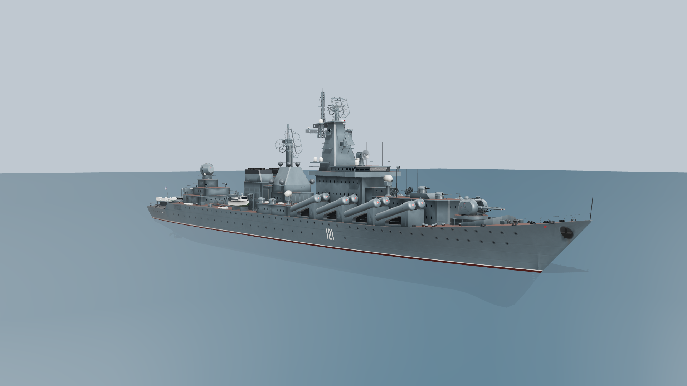
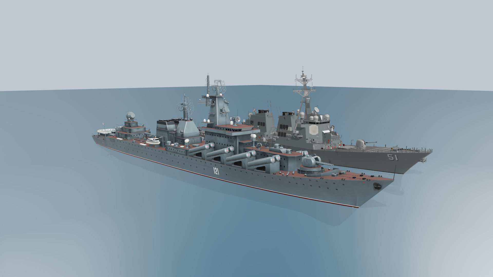
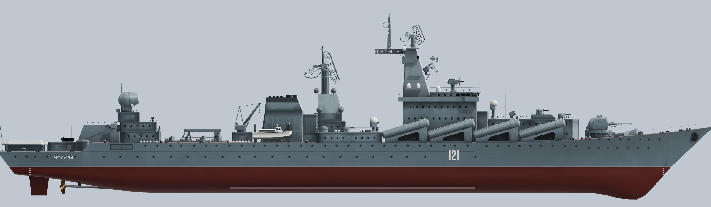

# Slava급 순양함 (Project 1164) — 로우폴리 모델



`slava_class_cruiser.glb`는 Free DDG-51(Arleigh Burke) 에셋과 같은 화풍, 같은 스케일로 새로 만든 Slava급 순양함 모델입니다. 기존 Sketchfab "Russian Slava-class cruiser" 모델은 품질이 낮아 지오메트리와 텍스처를 하나도 재사용하지 않고 처음부터 다시 만들었습니다. 기본 표기는 **Moskva(함번 121)** 입니다.

| 항목 | Slava (이 모델) | DDG-51 (기준 에셋) |
|---|---|---|
| 형식 | glTF 2.0 바이너리(`.glb`), 확장 없음 | glTF 2.0 바이너리 |
| 삼각형 / 정점 | 71,924 / 75,193 | 49,381 / 59,640 |
| 머티리얼 | 3개 | 5개 |
| 텍스처 구성 | baseColor + metallicRoughness + normal | 동일 |
| alpha 모드 | MASK(난간·레이더 메시·안전망) | MASK |
| 파일 크기 | 8.1 MB | 5.4 MB |
| 전장 | 186.4 m (실측 1:1) | 153.9 m (실측 1:1) |

## 좌표계

DDG-51 에셋과 같습니다. 같은 씬에 그대로 배치하면 실제 크기 비율이 맞습니다.

- 단위는 미터입니다.
- +Y가 위, +Z가 함수(뱃머리), +X가 좌현입니다.
- 설계 흘수선은 y = 0입니다.
- 원점은 전장의 중앙(z = 0)입니다. 함수는 z = +93.2, 함미는 z = −93.2입니다.



## 머티리얼

| 이름 | 크기 | 용도 |
|---|---|---|
| `Slava_Atlas` | 2048² RGBA | 선체 측면, 갑판 도장, 함번·함명, 창문, 난간, 레이더 메시, 헬기갑판 마킹, 장비 색상 견본 |
| `Slava_Paint` | 1024² 타일 | 상부구조와 장비의 회청색 도장 |
| `Slava_Deck` | 512² 타일 | 적갈색 갑판 도장 |

- 정점 컬러 `COLOR_0`에 앰비언트 오클루전을 구워 넣었습니다. glTF 표준에 따라 baseColor에 곱해집니다.
  - three.js, Babylon.js, Godot에서는 자동으로 적용됩니다.
  - Unity나 Unreal의 기본 머티리얼은 정점 컬러를 무시할 수 있습니다. 이 경우 음영만 약간 평평해지고 나머지는 정상입니다.

## 회전·애니메이션용 노드

각 노드의 피벗은 실제 회전 중심에 있습니다. 노드를 Y축으로 돌리면 선회, 포신 노드를 X축으로 돌리면 앙각이 됩니다.

| 노드 | 설명 |
|---|---|
| `AK130_Turret` → `AK130_Guns` | 130 mm 연장포의 선회부와 포신 |
| `AK630_1` ~ `AK630_6` | 30 mm CIWS |
| `RBU6000_P`, `RBU6000_S` | 대잠 로켓 발사기 |
| `BassTilt_1` ~ `BassTilt_3`, `KiteScreech`, `PopGroup_P`, `PopGroup_S` | 사격통제 레이더 |
| `Fregat_Radar`, `TopPair_Radar`, `FrontDoor`, `TopDome` | 탐색·유도 레이더 |
| `OsaM_P`, `OsaM_S` | Osa-M 승강식 발사기 |
| `Crane` | 크레인 |
| `Propeller_P`, `Propeller_S` | 추진기 |

정적인 부분은 `Hull`, `Superstructure`, `Launchers`(P-500/P-1000 16기), `Weapons_VLS`(S-300F 8기), `Boats`로 묶여 있습니다.

## 고증 근거

- **선형과 배치**: A. Kuleshov의 1:100 도면(1993)을 사용했습니다. 측면도, 평면도, 선도(정면 선도), 상세도 5·6·7번을 서로 정합한 뒤 치수를 측정했습니다. 도면은 개인 참고용이라 저장소에 포함하지 않았습니다.
- **사진 교차 검증**: Moskva(2009·2012·2017년), Varyag(2011·2017년), Marshal Ustinov(1993·2018년)의 Wikimedia Commons 사진과 비교했습니다.
- **주요 치수**: 전장 186.4 m, 최대 폭 20.8 m, 흘수 6.28 m(소나 돔 포함 8.1 m)입니다. 건현은 함수 10.9 m, 중앙부 6.7 m, 후갑판 4.4 m입니다.
- **함미 갑판**: 함미 쪽 단차, 고정식 헬기갑판, VDS(가변심도 소나) 해치를 반영했습니다.
- **레이더 안테나**: 1번 측면도에서 Top Pair(MR-800), Fregat, Front Door(Argon-1164)의 경사와 크기를 쟀습니다. 반사판 윤곽, 급전부, 뒷면 트러스는 Varyag(2017)와 Moskva(2009·2012) 근접 사진으로 확인했습니다.
- **무장**:
  - AK-130은 Varyag(2017), Nastoychivyy(2008), Bystryy의 근접 사진을 따랐습니다. 좌우 포드, 중앙 포신 슬롯, 타공 방폭판을 반영했습니다.
  - AK-630M은 Admiral Tributs(2016)와 Tula 박물관 사진, 3면도를 따랐습니다. 리브 받침, 후드, 6연장 포신 다발을 반영했습니다.
  - RBU-6000은 Varyag(2017) 사진을 따랐습니다.
  - S-300F 해치 구동부와 장전 갠트리는 Varyag(2011) 상공 사진을 따랐습니다. 구동부의 방향은 Slava(1984) 수직 항공사진으로 정했습니다.
  - S-300F 회전 해치는 박물관 모형 근접 사진을 따랐습니다. 해치마다 셀 덮개 8개가 있고, 덮개와 회색 장전 커버에는 작은 원 3개가 서로 겹치지 않게 들어갑니다. 장전 커버는 원형이 아니라 셀 덮개 위의 둥근 앞부분에서 구동부 쪽으로 곧게 늘어난 한 장의 판입니다. 커버를 잡는 암은 구동부 앞 모서리 옆 바닥 브래킷에 힌지로 달려 커버 옆면을 따라 나아가다 꺾여 커버 옆 가장자리의 힌지에 이어집니다. 구동부 상자도 같은 사진을 따라 만들었습니다. 측면 상자까지 포함한 구동부 전체가 양쪽 암 사이, 곧 커버 지름 안에 들어가도록 맞추고, 볼트 플랜지 덮개, 하트형 손잡이, 클램프가 달린 이음매, 걸쇠가 달린 상부 상자, 커버 뿌리의 볼트 고정 레일을 넣었습니다.
- **갑판 장비**:
  - 함수 환기구는 Slava(1985) 항공 사진을 따랐습니다.
  - 크레인과 구명뗏목 컨테이너는 Varyag(2012) 근접 사진을 따랐습니다. 크레인은 관형 A-프레임 기둥, 윈치 드럼, 아래쪽 힌지에 달린 모따기 지브와 토핑 와이어로 만들었습니다. 구명뗏목 컨테이너에는 고정 띠와 가운데 이음매를 넣었습니다.



## 다른 함정 버전

`tools/slava_generator`로 함번과 함명을 바꿔 다시 생성할 수 있습니다.

```bash
cd tools/slava_generator
pip install -r requirements.txt
python build.py ../../assets/models/slava_class_cruiser.glb             # Moskva 121 (현재 파일)
python build.py varyag.glb  --ship varyag                                # Varyag 011
python build.py ustinov.glb --ship ustinov                               # Marshal Ustinov 055
```

## 크레디트

- 비교 이미지(`previews/slava_vs_ddg51.png`)에 나오는 DDG-51은 Yi Tsung Lee의 "1:1 Low poly US NAVY DDG-51 USS Arleigh Burke"이며, CC-BY-4.0 라이선스입니다.
- 함번과 함명 글꼴은 Big Shoulders(SIL OFL 1.1)와 DejaVu Sans Bold(Bitstream Vera 라이선스)를 썼습니다. 생성기 안에 라이선스 파일과 함께 들어 있습니다.
