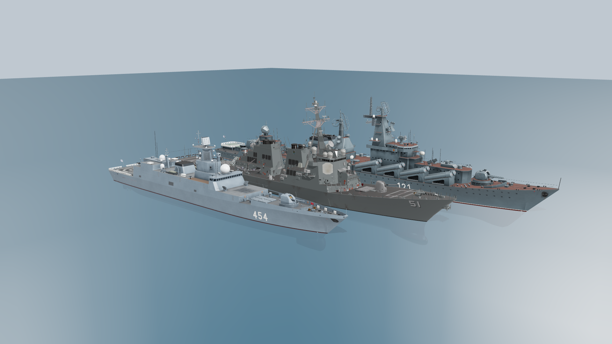
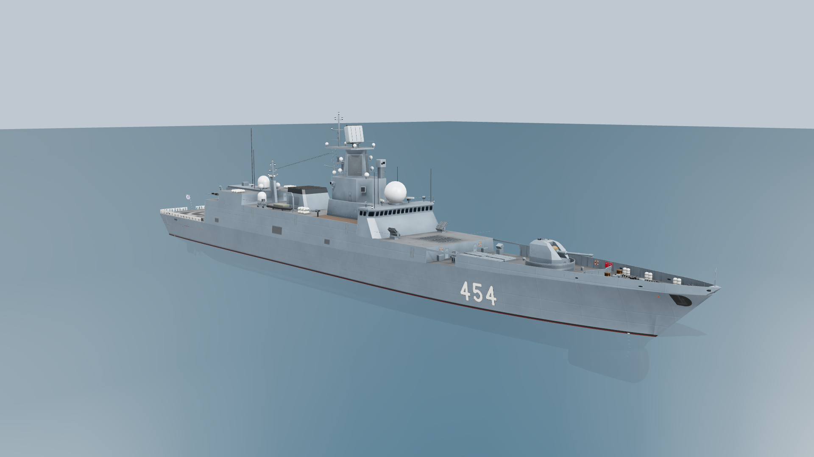
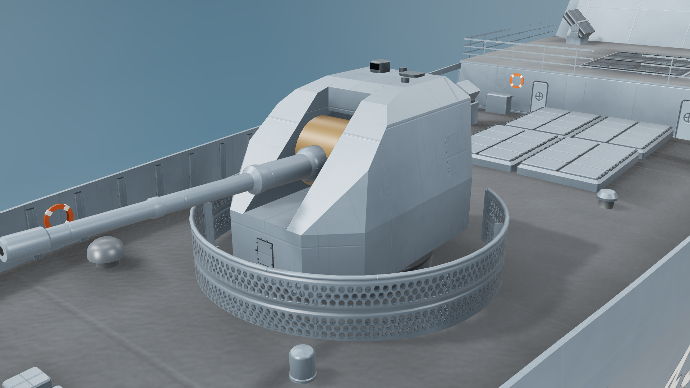
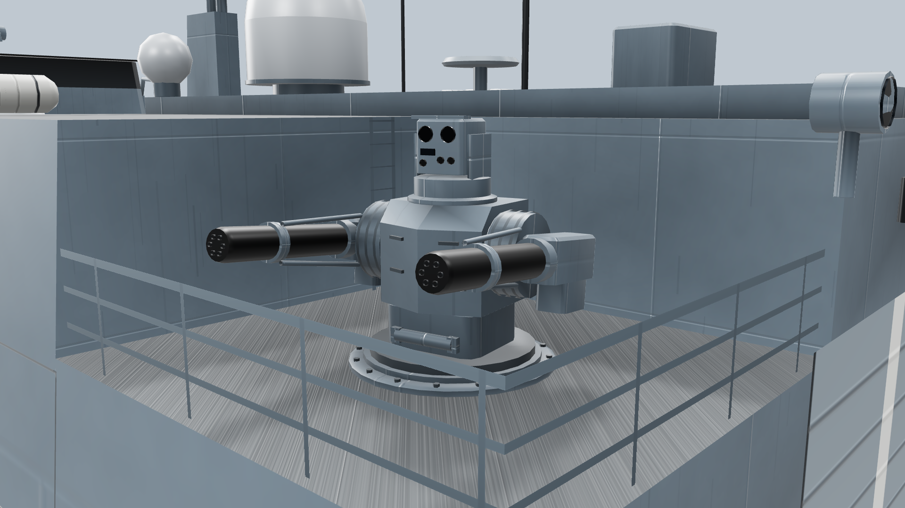
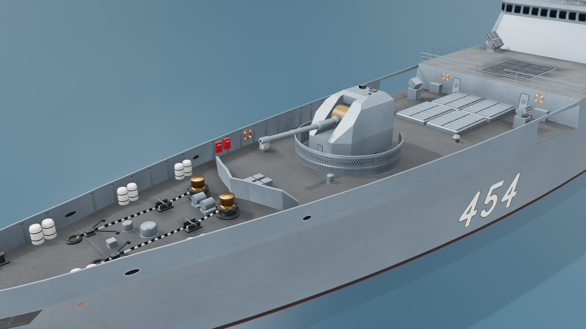
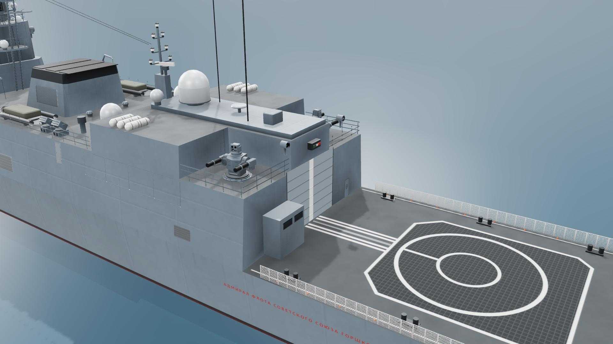
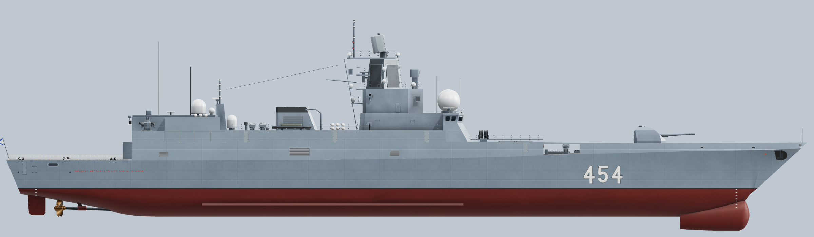
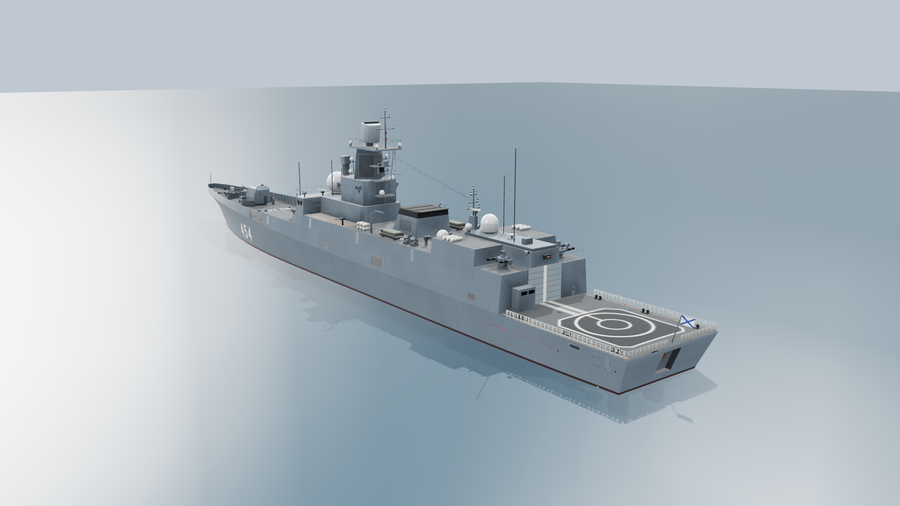

# 함정 모델

Free DDG-51(Arleigh Burke) 에셋과 같은 화풍, 같은 스케일, 같은 좌표계로 만든 로우폴리 함정 모델입니다. 두 모델 모두 `tools/`의 절차적 생성기로 다시 만들 수 있습니다.

| 파일 | 함정 | 삼각형 | 크기 | 생성기 |
|---|---|---|---|---|
| `slava_class_cruiser.glb` | Slava급 순양함 Moskva (121) | 75,086 | 8.3 MB | `tools/slava_generator` |
| `admiral_gorshkov_class_frigate.glb` | Admiral Gorshkov급 프리깃 Admiral Gorshkov (454) | 46,573 | 7.1 MB | `tools/gorshkov_generator` |



왼쪽부터 Admiral Gorshkov, DDG-51, Slava를 같은 축척으로 놓은 모습입니다.

## Slava급 순양함 (Project 1164) — 로우폴리 모델


`slava_class_cruiser.glb`는 Free DDG-51(Arleigh Burke) 에셋과 같은 화풍, 같은 스케일로 새로 만든 Slava급 순양함 모델입니다. 기존 Sketchfab "Russian Slava-class cruiser" 모델은 품질이 낮아 지오메트리와 텍스처를 하나도 재사용하지 않고 처음부터 다시 만들었습니다. 기본 표기는 **Moskva(함번 121)** 입니다.

| 항목 | Slava (이 모델) | DDG-51 (기준 에셋) |
|---|---|---|
| 형식 | glTF 2.0 바이너리(`.glb`), 확장 없음 | glTF 2.0 바이너리 |
| 삼각형 / 정점 | 75,086 / 78,444 | 49,381 / 59,640 |
| 머티리얼 | 3개 | 5개 |
| 텍스처 구성 | baseColor + metallicRoughness + normal | 동일 |
| alpha 모드 | MASK(난간·레이더 메시·안전망) | MASK |
| 파일 크기 | 8.3 MB | 5.4 MB |
| 전장 | 186.4 m (실측 1:1) | 153.9 m (실측 1:1) |

### 좌표계

DDG-51 에셋과 같습니다. 같은 씬에 그대로 배치하면 실제 크기 비율이 맞습니다.

- 단위는 미터입니다.
- +Y가 위, +Z가 함수(뱃머리), +X가 좌현입니다.
- 설계 흘수선은 y = 0입니다.
- 원점은 전장의 중앙(z = 0)입니다. 함수는 z = +93.2, 함미는 z = −93.2입니다.


### 머티리얼

| 이름 | 크기 | 용도 |
|---|---|---|
| `Slava_Atlas` | 2048² RGBA | 선체 측면, 갑판 도장, 함번·함명, 창문, 난간, 레이더 메시, 헬기갑판 마킹, 장비 색상 견본 |
| `Slava_Paint` | 1024² 타일 | 상부구조와 장비의 회청색 도장 |
| `Slava_Deck` | 512² 타일 | 적갈색 갑판 도장 |

- 정점 컬러 `COLOR_0`에 앰비언트 오클루전을 구워 넣었습니다. glTF 표준에 따라 baseColor에 곱해집니다.
  - three.js, Babylon.js, Godot에서는 자동으로 적용됩니다.
  - Unity나 Unreal의 기본 머티리얼은 정점 컬러를 무시할 수 있습니다. 이 경우 음영만 약간 평평해지고 나머지는 정상입니다.

### 회전·애니메이션용 노드

각 노드의 피벗은 실제 회전 중심에 있습니다. 노드를 Y축으로 돌리면 선회, 포신 노드를 X축으로 돌리면 앙각이 됩니다.

| 노드 | 설명 |
|---|---|
| `AK130_Turret` → `AK130_Guns` | 130 mm 연장포의 선회부와 포신 |
| `AK630_1` ~ `AK630_6` | 30 mm CIWS |
| `RBU6000_P`, `RBU6000_S` | 대잠 로켓 발사기 |
| `BassTilt_1` ~ `BassTilt_3`, `KiteScreech`, `PopGroup_P`, `PopGroup_S` | 사격통제 레이더 |
| `Fregat_Radar`, `TopPair_Radar`, `FrontDoor`, `TopDome` | 탐색·유도 레이더 |
| `OsaM_P`, `OsaM_S` | Osa-M 승강식 발사기 |
| `Crane` | 크레인 |
| `Propeller_P`, `Propeller_S` | 추진기 |

정적인 부분은 `Hull`, `Superstructure`, `Launchers`(P-500/P-1000 16기), `Weapons_VLS`(S-300F 8기), `Boats`로 묶여 있습니다.

### 고증 근거

- **선형과 배치**: A. Kuleshov의 1:100 도면(1993)을 사용했습니다. 측면도, 평면도, 선도(정면 선도), 상세도 5·6·7번을 서로 정합한 뒤 치수를 측정했습니다. 도면은 개인 참고용이라 저장소에 포함하지 않았습니다.
- **사진 교차 검증**: Moskva(2009·2012·2017년), Varyag(2011·2017년), Marshal Ustinov(1993·2018년)의 Wikimedia Commons 사진과 비교했습니다.
- **주요 치수**: 전장 186.4 m, 최대 폭 20.8 m, 흘수 6.28 m(소나 돔 포함 8.1 m)입니다. 건현은 함수 10.9 m, 중앙부 6.7 m, 후갑판 4.4 m입니다.
- **함미 갑판**: 함미 쪽 단차, 고정식 헬기갑판, VDS(가변심도 소나) 해치를 반영했습니다.
- **레이더 안테나**: 1번 측면도에서 Top Pair(MR-800), Fregat, Front Door(Argon-1164)의 경사와 크기를 쟀습니다. 반사판 윤곽, 급전부, 뒷면 트러스는 Varyag(2017)와 Moskva(2009·2012) 근접 사진으로 확인했습니다.
- **사진 정합 검증**: Moskva(2009·2012) 사진 3장에 카메라를 맞춰(랜드마크 8~12개, 오차 5~10 px) 모델을 같은 시점으로 렌더하고 비교했습니다. 이 비교로 아래 세 곳을 고쳤습니다.
  - Top Dome(3R41): 레이돔은 뒤쪽 위를 보고, 팔각 하우징은 앞쪽 아래(22°)를 향합니다. 크기와 높이는 사진을 따랐습니다(레이돔 꼭대기 약 20.3 m). 1993년 도면은 1.4 m 낮고 작게 그려져 있습니다.
  - 메인 마스트 ECM 레이돔: 한쪽에 4개씩, 알 모양 레이돔을 B 99.8 m에 두 쌍으로 쌓았습니다(높이 19.9 / 17.8 / 13.8 / 11.8 m). 기둥은 아래 2.6 m에서 위 1.6 m로 가늘어집니다.
  - 함번 121: 사진에서 잰 위치(함수에서 약 60 m)와 크기(글자 높이 약 3.3 m)로 옮겼습니다. 숫자는 사진의 서체처럼 획으로 그렸습니다.
- **함교**: Kuleshov 5번 도면(측면도·정면도·평면도)을 1번 측면도에 정합해 치수를 쟀고, 위 사진 정합으로 확인했습니다.
  - 함교실은 17.5 m 갑판에서 시작해 19.95 m 지붕까지 이어집니다. 벽은 바깥쪽으로 기울어 있고, 창문은 한 줄입니다(앞면 7개, 모서리면과 옆면 각 4개). 창문 위로 지붕까지 경사진 띠가 둘러져 있습니다.
  - 함교 아래층은 앞부분이 ±3.6 m로 좁고, 그 앞면이 함교 앞면과 같은 경사로 이어집니다. 그래서 함교가 아래층보다 최대 1.4 m 바깥으로 튀어나와 있습니다.
  - 함교 뒤로는 양옆에 철판 난간벽을 두른 통로가 있고, 통로 앞쪽 불룩한 부분에 근위함 문장이 붙어 있습니다. 지붕 앞 끝에는 활대가 달린 신호 마스트, 앞면 아래에는 등불 받침대가 있습니다.
- **무장**:
  - AK-130은 Varyag(2017), Nastoychivyy(2008), Bystryy의 근접 사진을 따랐습니다. 좌우 포드, 중앙 포신 슬롯, 타공 방폭판을 반영했습니다.
  - AK-630M은 Admiral Tributs(2016)와 Tula 박물관 사진, 3면도를 따랐습니다. 리브 받침, 후드, 6연장 포신 다발을 반영했습니다.
  - RBU-6000은 Varyag(2017) 사진을 따랐습니다.
  - S-300F 해치 구동부와 장전 갠트리는 Varyag(2011) 상공 사진을 따랐습니다. 구동부의 방향은 Slava(1984) 수직 항공사진으로 정했습니다.
  - S-300F 회전 해치는 박물관 모형 근접 사진을 따랐습니다. 해치마다 셀 덮개 8개가 있고, 덮개와 회색 장전 커버에는 작은 원 3개가 서로 겹치지 않게 들어갑니다. 장전 커버는 원형이 아니라 한 장의 판입니다. 셀 덮개 위의 앞부분은 반원보다 크게 둥글고, 옆선은 구동부 쪽으로 갈수록 곧게 좁아집니다. 커버를 잡는 암은 구동부 앞 모서리 옆 바닥 브래킷에 힌지로 달려 커버 옆면을 따라 나아가다 꺾여 커버 옆 가장자리의 힌지에 이어집니다. 구동부 상자도 같은 사진을 따라 만들었습니다. 측면 상자까지 포함한 구동부 전체가 양쪽 암 사이, 곧 커버 지름 안에 들어가도록 맞추고, 볼트 플랜지 덮개, 하트형 손잡이, 클램프가 달린 이음매, 걸쇠가 달린 상부 상자, 상자 앞 받침 프레임 위에 볼트 고정 레일을 넣었습니다.
- **갑판 장비**:
  - 함수 환기구는 Slava(1985) 항공 사진을 따랐습니다.
  - 크레인과 구명뗏목 컨테이너는 Varyag(2012) 근접 사진을 따랐습니다. 크레인은 관형 A-프레임 기둥, 윈치 드럼, 아래쪽 힌지에 달린 모따기 지브와 토핑 와이어로 만들었습니다. 구명뗏목 컨테이너에는 고정 띠와 가운데 이음매를 넣었습니다.


### 다른 함정 버전

`tools/slava_generator`로 함번과 함명을 바꿔 다시 생성할 수 있습니다.

```bash
cd tools/slava_generator
pip install -r requirements.txt
python build.py ../../assets/models/slava_class_cruiser.glb             # Moskva 121 (현재 파일)
python build.py varyag.glb  --ship varyag                                # Varyag 011
python build.py ustinov.glb --ship ustinov                               # Marshal Ustinov 055
```

### 크레디트

- 비교 이미지(`previews/slava_vs_ddg51.png`)에 나오는 DDG-51은 Yi Tsung Lee의 "1:1 Low poly US NAVY DDG-51 USS Arleigh Burke"이며, CC-BY-4.0 라이선스입니다.
- 함명 글꼴은 DejaVu Sans Bold(Bitstream Vera 라이선스)를 썼습니다. 함번 숫자는 생성기가 직접 획으로 그립니다. 숫자가 아닌 함번에는 Big Shoulders(SIL OFL 1.1)를 씁니다. 두 글꼴 모두 라이선스 파일과 함께 생성기 안에 들어 있습니다.

## Admiral Gorshkov급 프리깃 (Project 22350)



`admiral_gorshkov_class_frigate.glb`는 Slava와 같은 방식으로 처음부터 생성기로 만든 Admiral Gorshkov급 프리깃 모델입니다. 무료로 받을 수 있는 기존 모델은 게임에서 추출한 것이거나 형상이 부정확해서 쓰지 않았습니다. 기본 표기는 **Admiral Gorshkov(함번 454)** 입니다.

| 항목 | Admiral Gorshkov (이 모델) | DDG-51 (기준 에셋) |
|---|---|---|
| 형식 | glTF 2.0 바이너리(`.glb`), 확장 없음 | glTF 2.0 바이너리 |
| 삼각형 / 정점 | 46,573 / 47,839 | 49,381 / 59,640 |
| 머티리얼 | 3개 | 5개 |
| 텍스처 구성 | baseColor + metallicRoughness + normal | 동일 |
| alpha 모드 | MASK(난간·안전망·사다리) | MASK |
| 파일 크기 | 7.1 MB | 5.4 MB |
| 전장 | 135.0 m (실측 1:1) | 153.9 m (실측 1:1) |

### 좌표계

DDG-51, Slava와 같습니다. 단위는 미터, +Y가 위, +Z가 함수, +X가 좌현이고 설계 흘수선은 y = 0입니다. 원점은 전장의 중앙(z = 0)이며 함수는 z = +67.5, 함미는 z = −67.5입니다.

### 머티리얼

| 이름 | 크기 | 용도 |
|---|---|---|
| `Gorshkov_Atlas` | 2048² RGBA | 함번·붉은 함명, 닻 격납부와 붉은 별, 함수 개구부, 현창·해치, 창문, 난간, 안전망, 타공판, 헬기갑판 착함 구역, 수직발사기 덮개, 폴리멘트 배열면, 장비 색상 견본 |
| `Gorshkov_Paint` | 2048² 타일(12 m) | 밝은 회청색 도장, 3 × 2 m 판재마다 미세한 색차와 용접선 |
| `Gorshkov_Deck` | 1024² 타일(6 m) | UKSK 블록·01갑판·격납고 지붕의 회색 미끄럼 방지 도장과 갑판 이음선 |

정점 컬러 `COLOR_0`에 앰비언트 오클루전을 구워 넣은 것도 Slava와 같습니다.

### 회전·애니메이션용 노드

| 노드 | 설명 |
|---|---|
| `A192M` → `A192M_Gun` | 130 mm 함포의 선회부와 포신(피벗은 포이) |
| `Palash_P`, `Palash_S` → `*_Guns` | 30 mm CIWS의 선회부와 6연장 포 2문이 달린 포가 |
| `Furke4` | 5P-27 탐색 레이더 회전부 |

정적인 부분은 `Hull`, `Appendages`(추진축·프로펠러·방향타), `Forecastle`(양묘 장비, 파도막이, 현장 의장품), `Weapons`(Redut 32셀, UKSK 16셀, 기만체 발사기, MTPU), `Superstructure`, `Sensors`, `Boats`로 묶여 있습니다.

### 고증 근거

- **선형과 배치**: 1:500 일반배치도(좌·우현 측면도, 평면도, 정면도, 후면도)를 전장 135.0 m로 축척을 맞춘 뒤 측정했습니다. 도면은 상용 자료라 저장소에 넣지 않았습니다.
  - 전장 135.0 m, 너클(주갑판 가장자리) 폭 16.2 m, 흘수 4.55 m(소나 돔 포함 6.9 m)입니다.
  - 너클 높이는 함수 7.05 m에서 함미 4.92 m까지 낮아집니다. 너클 위의 현장, UKSK 블록, 01갑판, 격납고 옆면은 모두 선체와 같은 면에서 5.5° 안쪽으로 기운 스텔스 형상입니다.
  - 함수 현장에는 기만체 발사기가 들어가는 개구부(B 38.4–44.5 m)가 있습니다.
- **사진 교차 검증**: 러시아 국방부(2018년), 크렘린(2019년), Mehr 통신(2023년)이 공개한 Wikimedia Commons 사진(CC BY 4.0)과 비교했습니다.
- **사진 정합 검증**: 2018년 측면 사진에 카메라를 맞춰(랜드마크 12개, 오차 4.5 px) 모델을 같은 시점으로 렌더하고 비교했습니다. 이 비교로 아래를 고쳤습니다.
  - 격납고 앞면을 B 99.0 m로 옮겼습니다.
  - 팔라시 2기를 격납고 뒤쪽 양 모서리의 웰(높이 9.9 m) 안으로 내렸습니다. 지붕 위에 두면 사진보다 1.8 m 높게 보입니다.
  - 팔라시와 격납고 위 레이돔의 크기를 사진에 맞추고, 연돌 뒤와 격납고 위 레이돔을 캡슐형으로 바꿨습니다.
- **상부구조**:
  - 함교는 앞면이 경사진 블록이고, 창문은 앞면 14개, 모서리면 1개, 옆면 2개입니다. 지붕에 Puma 레이돔과 Pal-N 항해 레이더 2기가 있습니다.
  - 마스트는 앞이 뾰족한 하부 블록(B 64.8–75.0 m, 높이 17.0 m) 위에 45° 돌린 사각뿔 탑(B 68.3–74.4 m)을 얹은 형태입니다. 폴리멘트 배열면 4장(2.7 × 3.8 m)이 탑의 네 면에 있고, 옆 모서리에는 소형 레이돔이 2단으로, 뒤 모서리에는 ESM 상자가 붙어 있습니다. 하부 블록 앞에는 높은 받침 위의 광학 지향기가 있고, 22.3 m 플랫폼 위에 푸르케-4가 있습니다.
  - 연돌은 앞면과 옆면이 경사진 상자이고 윗부분은 검게 칠했습니다. 옆에는 단정 2척(B 83.8–90.2 m)과 앞쪽 다빗, 구명뗏목 받침대가 있습니다.
  - 격납고 앞에는 사다리가 달린 경사 핀 위에 야드 3단짜리 후방 마스트가 서 있습니다. 지붕에는 소형 레이돔 2기, 캡슐형 레이돔, 원판 안테나, 장비 상자, 휩 안테나 2개가 있고, 양옆 웰에 팔라시가 있습니다.
- **무장**: 아래 무장을 넣었습니다. Paket-NK 발사관은 격납고 옆면의 셔터 데칼로 표현했습니다.
  - A-192M 130 mm 함포: Arsenal 공장 완성품 사진, Arsenal 설계국 렌더, Admiral Gorshkov(2018)·Kasatonov(2020·2021) 사진에 맞춘 다면체 포탑입니다. 각 부분은 평면으로 잘라 만든 볼록 다면체입니다. 사진의 포탑이 도면보다 높아서 지붕 높이는 갑판 위 4.1 m로 했습니다.
    - 아래쪽은 수직 팔각형 띠입니다. 앞면은 폭 2 m로 볼트 고정 타원형 해치가 있고, 양옆 45° 모따기 면이 전폭으로 이어집니다.
    - 그 위의 좌우 볼(cheek) 블록 앞면은 두 면입니다. 약 42° 경사면이 앞끝에서 지붕 0.2 m 아래(B 26.1)까지 올라가고, 거기서 약 13°의 짧은 윗경사로 꺾여 지붕 앞끝(B 26.95)에 이어집니다. 바깥 아래 모서리는 삼각형 면으로 깎여 있습니다.
    - 옆면은 약 12° 안쪽으로 기울고, 지붕 가장자리에 큰 모따기가 있어 지붕 폭은 약 2.2 m입니다. 지붕은 포신 홈 위로 선회축(B 26.45)까지 덮여 있고, 뒤쪽은 비스듬히 깎여 수직 뒷면으로 이어집니다.
    - 두 볼 사이의 포신 홈(폭 약 1.2 m)은 큰 황동색 요가 원통(반지름 0.8 m, 포이축 B 26.1·갑판 위 2.6 m)이 채우고, 원통은 홈 앞으로 튀어나와 있습니다. 포신 끝은 굵은 포구부로 끝납니다.
    - 방호링은 반지름 3.55 m·높이 1.35 m의 타공판으로 뒤쪽 ±35°가 열려 있습니다.
  - Redut 8셀 모듈 4기: 모듈마다 덮개 2열 × 4개, 바깥쪽 힌지가 있습니다.
  - UKSK 3S14 16셀: 8셀 모듈 2기가 앞뒤로 놓이고, 덮개 열마다 앞뒤 끝에 힌지가 있습니다.
  - 팔라시 2기: KBP 전시 모형(Army-2016)과 Palma-SU 실물 사진에 맞춰 다시 만들었습니다. 높이 약 2.3 m, 포 사이 폭 약 2.4 m입니다.
    - 볼트 고정 갑판 링 위에 완충 실린더가 달린 받침대를 놓고, 그 위에 앞이 V자로 꺾인 중앙 하우징을 올렸습니다.
    - 하우징 양옆에 홈이 패인 요가 드럼이 있고, 그 바깥에 AO-18KD 6연장포가 있습니다(수신부, 검은 포신 케이스, 6개 포구, 클램프 링과 지지대).
    - 위에는 회전 받침 위의 광학 사격통제 헤드가 있습니다.
    - 22350급은 미사일 없는 포 전용형이라 Sosna-R 발사관은 넣지 않았습니다.
  - MTPU 14.5 mm 기관총 2정.
  - 기만체 발사기: 현장 개구부와 01갑판에 KT-216(받침대와 단포신 묶음), UKSK 블록에 장포신 2연장 발사기.

- **HD 보강(도면과 사진 대조)**: 평면도에서 갑판 의장품의 위치를 다시 재고, 사진으로 형상을 맞췄습니다.
  - 함수 갑판은 2018년 항공 사진과 2021년 Admiral Kasatonov 사진에 맞췄습니다. 닻줄은 호스파이프(B 8.5 m)에서 컴프레서, 스토퍼(B 13.4 m)를 지나 청동 머리의 세로축 캡스턴(B 15.6 m)으로 이어집니다. 그 뒤에 꼭짓점이 앞을 향한 V자 파도막이(B 16.9–18.6 m, 높이 1.2 m)가 있고, 현장 안쪽에는 흰 직립 원통 3쌍, 붉은 소화 상자, 구명부환이 있습니다.
  - 선체: 너클 아래 D자 닻 격납부와 그 안의 스톡리스 닻, 붉은 별, 함수 개구부, 현장 페어리드를 넣었습니다(2021년 Admiral Golovko 사진). 선미 쪽에는 붉은 함명(B 112–123 m, 높이 3.1 m), 현창, 계류 개구부, 해치를 넣었습니다(측면 사진, 도면).
  - 헬기갑판: 미끄럼 방지 망 무늬의 착함 구역(B 120.6–132.7 m), 착함원, 견인 레일 유도선, 세운 안전망, 좌현 착함 통제실을 넣었습니다(선미 항공 사진).
  - 01갑판 덮개가 빠져 있던 오류를 고쳤습니다.
- **무장 참고 사진**: A-192M은 Arsenal 공장 완성품 사진(bmpd 게재), Arsenal 설계국 렌더(vlad_burtsev 블로그 게재), Admiral Gorshkov 2018년·Admiral Kasatonov 2021년 사진(러시아 국방부, CC BY 4.0), Admiral Kasatonov 2020년 네바강 사진(Bestalex, CC0), Jeff Head의 Flickr 앨범에 있는 Admiral Gorshkov 사진을 참고했습니다. 측면도와 겹쳐 앞 경사면·지붕·뒷면 위치를 확인했고, 앞면 경사가 꺾이는 위치는 좌현 선수 쪽 사진에 카메라를 맞춰 쟀습니다. 팔라시는 Wikimedia Commons의 Army-2016 전시 모형 사진(LeAZ-1977, CC BY-SA 4.0)과 Palma-SU 사진(러시아 국방부, CC BY 4.0)을 참고했습니다. 사진은 형상 참고용으로만 썼고 저장소에는 넣지 않았습니다.
- **정합 확인**: 수정 후에도 측면 사진 정합 카메라로 다시 렌더해 전체 윤곽이 사진과 겹치는지 확인했고, 도면 측면·평면과 30 px/m 비교 이미지로 구역별 위치를 확인했습니다.













### 다른 함정 버전

```bash
cd tools/gorshkov_generator
pip install -r requirements.txt
python build.py ../../assets/models/admiral_gorshkov_class_frigate.glb   # Admiral Gorshkov 454 (현재 파일)
python build.py kasatonov.glb --ship kasatonov                            # Admiral Kasatonov 461
python build.py golovko.glb   --ship golovko                              # Admiral Golovko 456
python build.py gorshkov_417.glb --pennant 417                            # 2018~2020년 함번
```

### 크레디트

- 비교 이미지(`previews/gorshkov_lineup.png`)에 나오는 DDG-51은 Yi Tsung Lee의 "1:1 Low poly US NAVY DDG-51 USS Arleigh Burke"이며, CC-BY-4.0 라이선스입니다.
- 함명 글꼴과 함번 숫자는 Slava 생성기와 같은 것을 씁니다.
